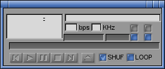

# Sigma Shadows for Winamp

This is an old skin for Winamp I made back in the dark ages. I just recently found it laying around and decided to put it up here for archiving purposes. I haven't used winamp for eons and I have absolutely no idea which version this was created for, so I have no idea if this is still usable or not.

</img>

From info.txt:
```
Sigma Shadows For Winamp
------------------------

04/18/2000 - Created by Thomas Hellstrom <thohell@home.se>

This skin is based on Sigma Shadows by Shawn Murdock <smurdock@nacs.net>
```

